# Дипломный практикум в Yandex.Cloud - Балдин
  * [Цели:](#цели)
  * [Этапы выполнения:](#этапы-выполнения)
     * [Создание облачной инфраструктуры](#создание-облачной-инфраструктуры)
     * [Создание Kubernetes кластера](#создание-kubernetes-кластера)
     * [Создание тестового приложения](#создание-тестового-приложения)
     * [Подготовка cистемы мониторинга и деплой приложения](#подготовка-cистемы-мониторинга-и-деплой-приложения)
     * [Установка и настройка CI/CD](#установка-и-настройка-cicd)
  * [Что необходимо для сдачи задания?](#что-необходимо-для-сдачи-задания)
  * [Как правильно задавать вопросы дипломному руководителю?](#как-правильно-задавать-вопросы-дипломному-руководителю)

**Перед началом работы над дипломным заданием изучите [Инструкция по экономии облачных ресурсов](https://github.com/netology-code/devops-materials/blob/master/cloudwork.MD).**

---
## Цели:

1. Подготовить облачную инфраструктуру на базе облачного провайдера Яндекс.Облако.
2. Запустить и сконфигурировать Kubernetes кластер.
3. Установить и настроить систему мониторинга.
4. Настроить и автоматизировать сборку тестового приложения с использованием Docker-контейнеров.
5. Настроить CI для автоматической сборки и тестирования.
6. Настроить CD для автоматического развёртывания приложения.

---
## Этапы выполнения:


### Создание облачной инфраструктуры

Для начала необходимо подготовить облачную инфраструктуру в ЯО при помощи [Terraform](https://www.terraform.io/).

Особенности выполнения:

- Бюджет купона ограничен, что следует иметь в виду при проектировании инфраструктуры и использовании ресурсов;
Для облачного k8s используйте региональный мастер(неотказоустойчивый). Для self-hosted k8s минимизируйте ресурсы ВМ и долю ЦПУ. В обоих вариантах используйте прерываемые ВМ для worker nodes.

Предварительная подготовка к установке и запуску Kubernetes кластера.

1. Создайте сервисный аккаунт, который будет в дальнейшем использоваться Terraform для работы с инфраструктурой с необходимыми и достаточными правами. Не стоит использовать права суперпользователя
2. Подготовьте [backend](https://developer.hashicorp.com/terraform/language/backend) для Terraform:  
   а. Рекомендуемый вариант: S3 bucket в созданном ЯО аккаунте(создание бакета через TF)
   б. Альтернативный вариант:  [Terraform Cloud](https://app.terraform.io/)
3. Создайте конфигурацию Terrafrom, используя созданный бакет ранее как бекенд для хранения стейт файла. Конфигурации Terraform для создания сервисного аккаунта и бакета и основной инфраструктуры следует сохранить в разных папках.
4. Создайте VPC с подсетями в разных зонах доступности.
5. Убедитесь, что теперь вы можете выполнить команды `terraform destroy` и `terraform apply` без дополнительных ручных действий.
6. В случае использования [Terraform Cloud](https://app.terraform.io/) в качестве [backend](https://developer.hashicorp.com/terraform/language/backend) убедитесь, что применение изменений успешно проходит, используя web-интерфейс Terraform cloud.

Ожидаемые результаты:

1. Terraform сконфигурирован и создание инфраструктуры посредством Terraform возможно без дополнительных ручных действий, стейт основной конфигурации сохраняется в бакете или Terraform Cloud
2. Полученная конфигурация инфраструктуры является предварительной, поэтому в ходе дальнейшего выполнения задания возможны изменения.

### Выполнение:

Создал сервисный аккаунт для дальнейшего использоваться Terraform в работе с инфраструктурой с правами `editor`:

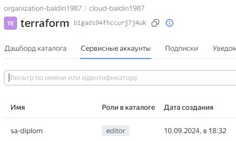

Подготовил backend для Terraform, использовав для этого S3 bucket:

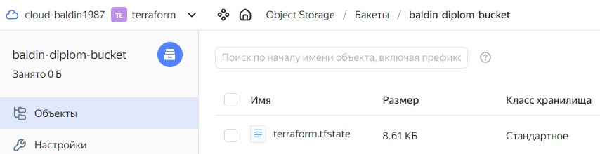

Создал vpc с подсетями в трех зонах доступности:

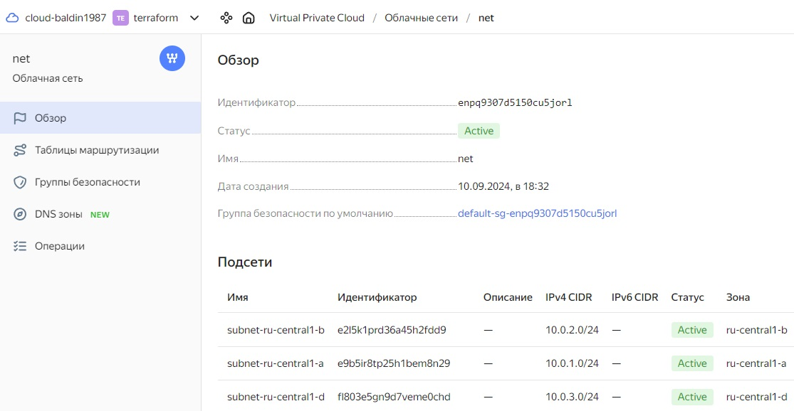

Команды `terraform apply` и `terraform destroy` выполняются без дополнительных ручных действий:

<details>
<summary>terraform apply - terraform destroy</summary>

```bash


```

</details>


Код описания создаваемой инфраструктуры лежит тут: [**1-terraform**](https://github.com/baldin-lex/diplom/tree/main/1-terraform)

---
### Создание Kubernetes кластера

На этом этапе необходимо создать [Kubernetes](https://kubernetes.io/ru/docs/concepts/overview/what-is-kubernetes/) кластер на базе предварительно созданной инфраструктуры.   Требуется обеспечить доступ к ресурсам из Интернета.

Это можно сделать двумя способами:

1. Рекомендуемый вариант: самостоятельная установка Kubernetes кластера.  
   а. При помощи Terraform подготовить как минимум 3 виртуальных машины Compute Cloud для создания Kubernetes-кластера. Тип виртуальной машины следует выбрать самостоятельно с учётом требовании к производительности и стоимости. Если в дальнейшем поймете, что необходимо сменить тип инстанса, используйте Terraform для внесения изменений.  
   б. Подготовить [ansible](https://www.ansible.com/) конфигурации, можно воспользоваться, например [Kubespray](https://kubernetes.io/docs/setup/production-environment/tools/kubespray/)  
   в. Задеплоить Kubernetes на подготовленные ранее инстансы, в случае нехватки каких-либо ресурсов вы всегда можете создать их при помощи Terraform.
2. Альтернативный вариант: воспользуйтесь сервисом [Yandex Managed Service for Kubernetes](https://cloud.yandex.ru/services/managed-kubernetes)  
  а. С помощью terraform resource для [kubernetes](https://registry.terraform.io/providers/yandex-cloud/yandex/latest/docs/resources/kubernetes_cluster) создать **региональный** мастер kubernetes с размещением нод в разных 3 подсетях      
  б. С помощью terraform resource для [kubernetes node group](https://registry.terraform.io/providers/yandex-cloud/yandex/latest/docs/resources/kubernetes_node_group)
  
Ожидаемый результат:

1. Работоспособный Kubernetes кластер.
2. В файле `~/.kube/config` находятся данные для доступа к кластеру.
3. Команда `kubectl get pods --all-namespaces` отрабатывает без ошибок.

### Выполнение:

Скачал репозиторий [**Kubespray**](https://github.com/kubernetes-sigs/kubespray.git). Сделал копию папку `sample` и переименовал ее в `mycluster`.

Командой `terraform apply` в процессе развертывания инфраструктуры создается файл инфентаря по заданному [**шаблону**](https://github.com/baldin-lex/diplom/1-Terraform/hosts.tftpl). Этот **inventory.yaml** кладется в директорию `/home/baldin/new_diplom/modify/2-kubespray/inventory/mycluster/inventory.yaml`. Он в последствии используется **Kubespray** при деплое Kubernetes-кластера. 

Устанавливаю нужные для безошибочной работы плэйбука зависимости: `python3 -m pip install -r requirements.txt`

Запускаю деплой кластера при помощи команды: `ansible-playbook -i inventory/mycluster/inventory.yaml -u ubuntu --become --become-user=root --private-key=~/.ssh/id_ed25519 -e 'ansible_ssh_common_args="-o StrictHostKeyChecking=no"' cluster.yml`

После того, как он отработал:

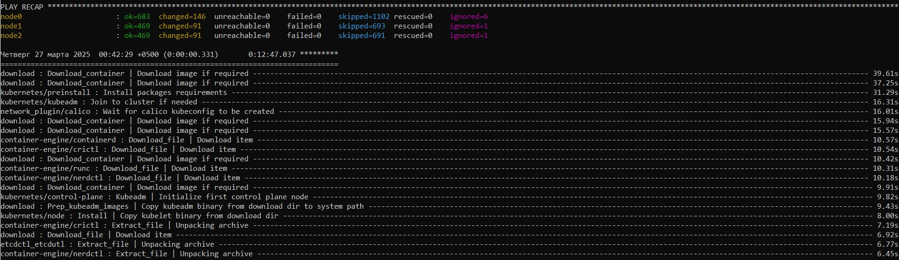

Перехожу на master-ноду и кладу config-файл в домашнюю папку пользователя ubuntu, после чего накидываю права:

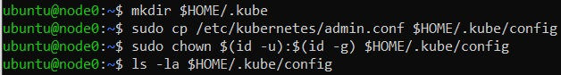

Проверяю результат, смотрю вывод `get pods --all-namespaces`

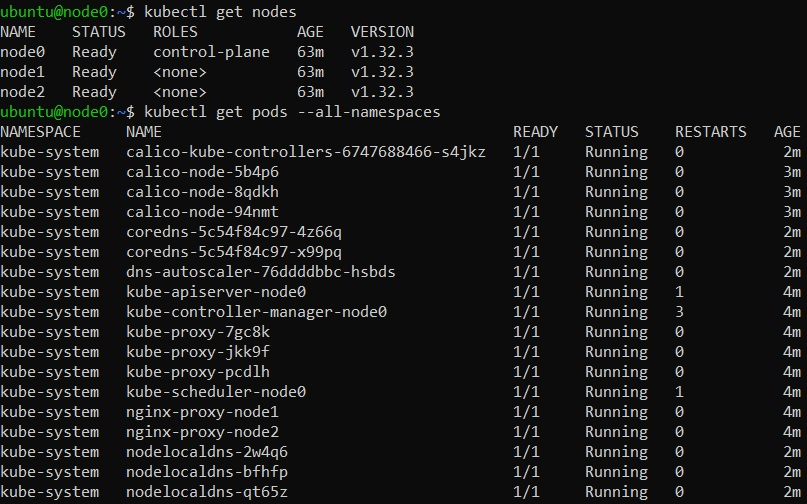

Проверяю, что **~/.kube/config** содержит данные для подключения к кластеру:

<details>
<summary>kube/config</summary>

```yaml
ubuntu@node0:~$ cat /home/ubuntu/.kube/config
apiVersion: v1
clusters:
- cluster:
    certificate-authority-data: LS0tLS1CRUdJTiBD....................lDQVRFLS0tLS0K
    server: https://127.0.0.1:6443
  name: cluster.local
contexts:
- context:
    cluster: cluster.local
    user: kubernetes-admin
  name: kubernetes-admin@cluster.local
current-context: kubernetes-admin@cluster.local
kind: Config
preferences: {}
users:
- name: kubernetes-admin
  user:
    client-certificate-data: LS0tLS1CRUdJTiB.........................DQVRFLS0tLS0K
    client-key-data: LS0tLS1CRUdJTiBS................................FWS0tLS0tCg==
```

</details>

---

### Создание тестового приложения

Для перехода к следующему этапу необходимо подготовить тестовое приложение, эмулирующее основное приложение разрабатываемое вашей компанией.

Способ подготовки:

1. Рекомендуемый вариант:  
   а. Создайте отдельный git репозиторий с простым nginx конфигом, который будет отдавать статические данные.  
   б. Подготовьте Dockerfile для создания образа приложения.  
2. Альтернативный вариант:  
   а. Используйте любой другой код, главное, чтобы был самостоятельно создан Dockerfile.

Ожидаемый результат:

1. Git репозиторий с тестовым приложением и Dockerfile.
2. Регистри с собранным docker image. В качестве регистри может быть DockerHub или [Yandex Container Registry](https://cloud.yandex.ru/services/container-registry), созданный также с помощью terraform.

### Выполнение:

Приложение, запущенное в кластере – это Nginx, который будет отдавать web-страницу.

Репозиторий с Dockerfile и тестовым приложением находится тут: https://github.com/baldin-lex/diplom-app-test/tree/main

Регистри с собранным docker image - тут: https://hub.docker.com/repository/docker/baldinlex/diplom/general

---
### Подготовка cистемы мониторинга и деплой приложения

Уже должны быть готовы конфигурации для автоматического создания облачной инфраструктуры и поднятия Kubernetes кластера.  
Теперь необходимо подготовить конфигурационные файлы для настройки нашего Kubernetes кластера.

Цель:
1. Задеплоить в кластер [prometheus](https://prometheus.io/), [grafana](https://grafana.com/), [alertmanager](https://github.com/prometheus/alertmanager), [экспортер](https://github.com/prometheus/node_exporter) основных метрик Kubernetes.
2. Задеплоить тестовое приложение, например, [nginx](https://www.nginx.com/) сервер отдающий статическую страницу.

Способ выполнения:
1. Воспользоваться пакетом [kube-prometheus](https://github.com/prometheus-operator/kube-prometheus), который уже включает в себя [Kubernetes оператор](https://operatorhub.io/) для [grafana](https://grafana.com/), [prometheus](https://prometheus.io/), [alertmanager](https://github.com/prometheus/alertmanager) и [node_exporter](https://github.com/prometheus/node_exporter). Альтернативный вариант - использовать набор helm чартов от [bitnami](https://github.com/bitnami/charts/tree/main/bitnami).

2. Если на первом этапе вы не воспользовались [Terraform Cloud](https://app.terraform.io/), то задеплойте и настройте в кластере [atlantis](https://www.runatlantis.io/) для отслеживания изменений инфраструктуры. Альтернативный вариант 3 задания: вместо Terraform Cloud или atlantis настройте на автоматический запуск и применение конфигурации terraform из вашего git-репозитория в выбранной вами CI-CD системе при любом комите в main ветку. Предоставьте скриншоты работы пайплайна из CI/CD системы.

Ожидаемый результат:
1. Git репозиторий с конфигурационными файлами для настройки Kubernetes.
2. Http доступ на 80 порту к web интерфейсу grafana.
3. Дашборды в grafana отображающие состояние Kubernetes кластера.
4. Http доступ на 80 порту к тестовому приложению.
5. Atlantis или terraform cloud или ci/cd-terraform

### Выполнение:

#### Настраиваю мониторинг:

Создаю нэймспэйс `monitoring`, скачиваю репозиторий и устанавливаю систему мониторинга:

```yaml
ubuntu@node0:~$ sudo kubectl create namespace monitoring
namespace/monitoring created
ubuntu@node0:~$ sudo helm repo add prometheus-community https://prometheus-community.github.io/helm-charts
"prometheus-community" has been added to your repositories
ubuntu@node0:~$ sudo helm install stable prometheus-community/kube-prometheus-stack --namespace=monitoring
NAME: stable
LAST DEPLOYED: Sat Mar 29 20:39:45 2025
NAMESPACE: monitoring
STATUS: deployed
REVISION: 1
NOTES:
kube-prometheus-stack has been installed. Check its status by running:
  kubectl --namespace monitoring get pods -l "release=stable"

Get Grafana 'admin' user password by running:

  kubectl --namespace monitoring get secrets stable-grafana -o jsonpath="{.data.admin-password}" | base64 -d ; echo

Access Grafana local instance:

  export POD_NAME=$(kubectl --namespace monitoring get pod -l "app.kubernetes.io/name=grafana,app.kubernetes.io/instance=stable" -oname)
  kubectl --namespace monitoring port-forward $POD_NAME 3000

Visit https://github.com/prometheus-operator/kube-prometheus for instructions on how to create & configure Alertmanager and Prometheus instances using the Operator.
ubuntu@node0:~$ kubectl edit svc stable-kube-prometheus-sta-prometheus -n monitoring
service/stable-kube-prometheus-sta-prometheus edited
ubuntu@node0:~$ kubectl edit svc stable-grafana -n monitoring
service/stable-grafana edited
```

Тип сервисов `grafana` и `prometheus` нужно поменять в конфиге на `NodePort`, чтобы был доступ к мониторингу:

`sudo kubectl edit svc stable-kube-prometheus-sta-prometheus -n monitoring`

`sudo kubectl edit svc stable-grafana -n monitoring`

Проверим сервисы в нэймспэйсе `monitoring`:

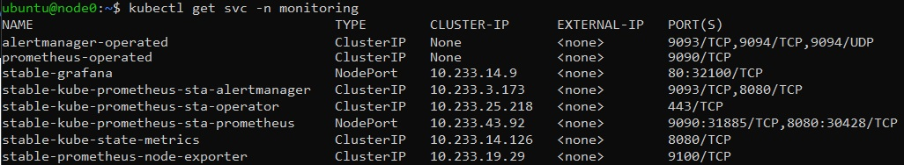

Смотрим, что показывает дашборд:

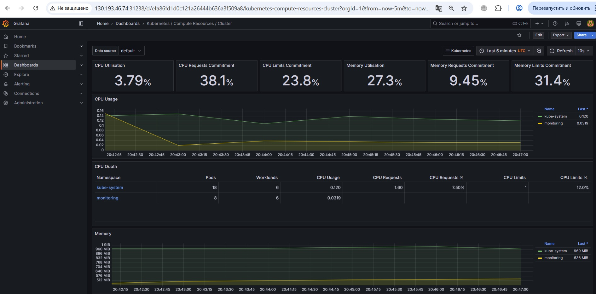

Как видим, метрики по состоянию кластера отдаются.

#### Деплой приложения:

Создаю нэймспэйс `diplom-app` 

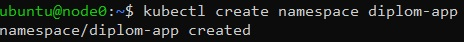

Манифест выглядит так:

```yaml
apiVersion: apps/v1
kind: Deployment
metadata:
  name: diplom-app
  namespace: diplom-app
  labels:
    app: web-app
spec:
  replicas: 1
  selector:
    matchLabels:
      app: web-app
  template:
    metadata:
      labels:
        app: web-app
    spec:
      containers:
      - name: diplom
        image: baldinlex/diplom:1.0
        resources:
          requests:
            cpu: "1"
            memory: "200Mi"
          limits:
            cpu: "2"
            memory: "400Mi"
        ports:
        - containerPort: 80
```

Запускаю деплой `kubectl apply -f deployment.yaml -n diplom-app` и проверяю результат:

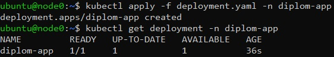

Также нужен сервис `NodePort` для предоставления доступа к приложению снаружи. Вот его манифест:

```yaml
apiVersion: v1
kind: Service
metadata:
  name: diplom-app
  namespace: diplom-app
spec:
  type: NodePort
  selector:
    app: web-app
  ports:
  - protocol: TCP
    port: 80
    nodePort: 30080 
```

Выполняю `kubectl apply -f service.yaml -n diplom-app`

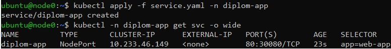

Проверяю доступ к приложению по белому IP:


---
### Установка и настройка CI/CD

Осталось настроить ci/cd систему для автоматической сборки docker image и деплоя приложения при изменении кода.

Цель:

1. Автоматическая сборка docker образа при коммите в репозиторий с тестовым приложением.
2. Автоматический деплой нового docker образа.

Можно использовать [teamcity](https://www.jetbrains.com/ru-ru/teamcity/), [jenkins](https://www.jenkins.io/), [GitLab CI](https://about.gitlab.com/stages-devops-lifecycle/continuous-integration/) или GitHub Actions.

Ожидаемый результат:

1. Интерфейс ci/cd сервиса доступен по http.
2. При любом коммите в репозиторие с тестовым приложением происходит сборка и отправка в регистр Docker образа.
3. При создании тега (например, v1.0.0) происходит сборка и отправка с соответствующим label в регистри, а также деплой соответствующего Docker образа в кластер Kubernetes.

### Выполнение:

В качестве ci/cd системы взял GitLab CI.

Создал репозиторий в [gitlab](https://gitlab.com/abaldin1987/diplom-app.git), в который поместил web-контент и Dockerfile, которые создал на этапе создания тестового приложения.

Для работы пайплайна нужно настроить раннер в проекте:

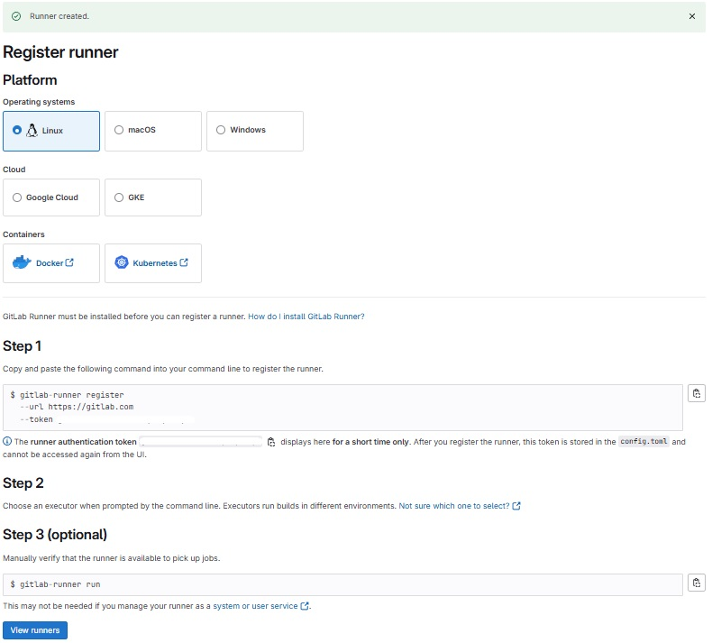


---
## Что необходимо для сдачи задания?

1. Репозиторий с конфигурационными файлами Terraform и готовность продемонстрировать создание всех ресурсов с нуля.
2. Пример pull request с комментариями созданными atlantis'ом или снимки экрана из Terraform Cloud или вашего CI-CD-terraform pipeline.
3. Репозиторий с конфигурацией ansible, если был выбран способ создания Kubernetes кластера при помощи ansible.
4. Репозиторий с Dockerfile тестового приложения и ссылка на собранный docker image.
5. Репозиторий с конфигурацией Kubernetes кластера.
6. Ссылка на тестовое приложение и веб интерфейс Grafana с данными доступа.
7. Все репозитории рекомендуется хранить на одном ресурсе (github, gitlab)
